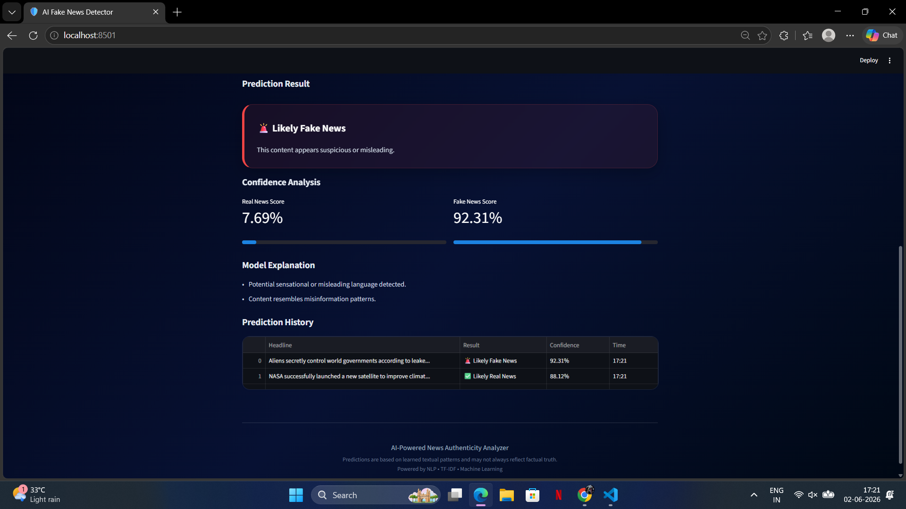

# 📰 AI Fake News Detector
AI-powered fake news detection using NLP, TF-IDF, and Machine Learning with explainable confidence scoring.

An AI-powered Fake News Detection web application built using Machine Learning and Natural Language Processing (NLP). The system analyzes news headlines and articles to predict whether content is likely real or fake using confidence scoring and explainable AI insights.


## 📸 Project Demo

### Home Interface


### Prediction Result



## ✨ Features

* AI-powered fake news detection using Machine Learning
* TF-IDF based text vectorization
* Explainable confidence scoring
* Real vs Fake confidence analysis
* Prediction history tracking
* Sample headline testing
* Edge-case handling for uncertain inputs
* Interactive Streamlit dashboard

## ⚙️ How It Works

1. News headline/article text is entered by the user.
2. Text preprocessing and cleaning are applied.
3. TF-IDF vectorization converts text into numerical features.
4. The trained Machine Learning model predicts whether the content is likely real or fake.
5. Confidence scores and explainable insights are displayed to the user.


## 🚀 Key Highlights

* Built an end-to-end NLP-based fake news detection system using TF-IDF and Machine Learning.
* Implemented explainable AI confidence scoring for transparent predictions.
* Designed a responsive Streamlit dashboard with prediction history and edge-case handling.
* Improved model reliability using additional curated fake and real news datasets.


## 🛠️ Tech Stack

### Frontend
- Streamlit

### Backend
- Python

### Machine Learning / NLP
- Scikit-learn
- TF-IDF Vectorization
- Logistic Regression / ML Classification
- Natural Language Processing (NLP)

### Data Processing
- Pandas
- NumPy

## 📂 Project Structure

```text
fake-news-detection/
│── app/
│   └── app.py
│
│── assets/
│   ├── home.png
│   └── prediction.png
│
│── data/
│   ├── Fake.csv
│   ├── True.csv
│   ├── extra_fake_news.csv
│   └── extra_real_news.csv
│
│── models/
│   ├── fake_news_model.pkl
│   └── tfidf_vectorizer.pkl
│
│── notebooks/
│   └── data_exploration.ipynb
│
│── src/
│   ├── preprocess.py
│   ├── predict.py
│   └── train_model.py
│
│── requirements.txt
│── README.md
```


## ⚙️ Installation

Clone the repository:

```bash
git clone https://github.com/whiskerwolf/ai-fake-news-detector.git
cd ai-fake-news-detector
```

Install dependencies:

```bash
pip install -r requirements.txt
```

Run the application:

```bash
streamlit run app/app.py
```

## 🧪 Example Predictions

| Headline | Prediction |
|----------|------------|
| NASA launches new climate satellite | Real News |
| Aliens secretly control governments | Fake News |


## 🎯 Future Improvements

- Live News API integration
- Multi-language fake news detection
- Deep Learning model enhancement
- Real-time fact verification

## 👨‍💻 Author

**Rithwik Nalla**

AI & Data Enthusiast